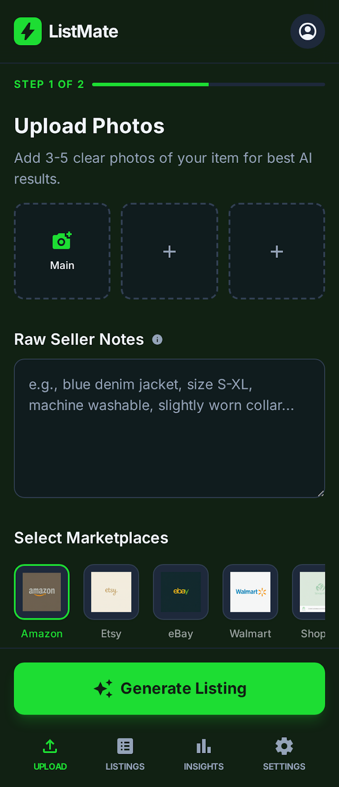
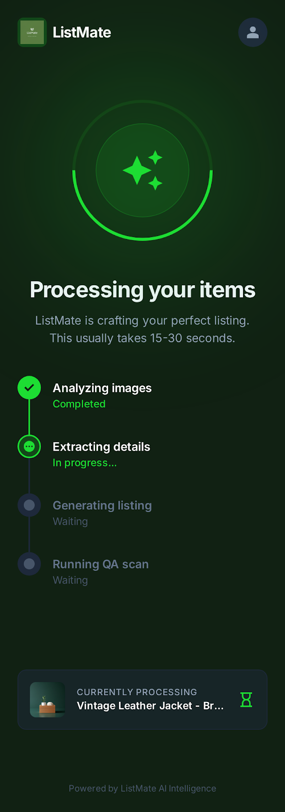
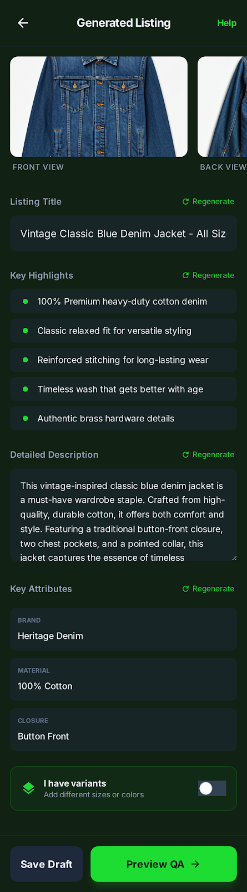
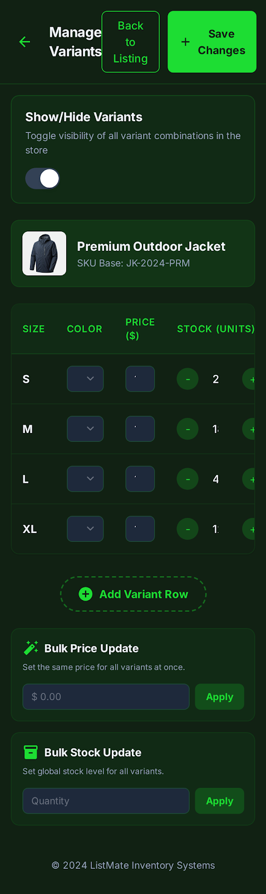
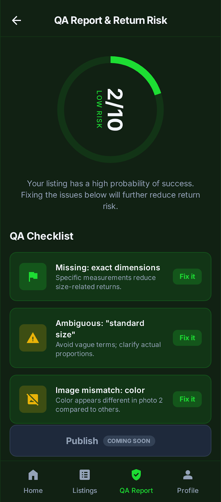

<div align="center">
  
  <h1>ListMate</h1>
  <p><strong>AI-powered listing copilot for marketplace sellers</strong></p>
  <p>
    Upload photos → get a complete, optimised listing in seconds — with built-in QA, variant management, and one-tap export.
  </p>

  
  
  
  
</div>

---

## What is ListMate?

Selling on Amazon, Etsy, eBay, Walmart, or Shopify takes time — not because the product is hard to describe, but because every marketplace has its own format, character limits, required attributes, and SEO conventions. Most sellers either under-describe their items (hurting conversion) or spend 20-30 minutes per listing getting it right.

**ListMate cuts that to under 60 seconds.**

You upload 3-5 product photos and jot a few raw notes. ListMate's AI analyses the images, extracts every relevant detail, and generates a fully formatted listing — including title, key highlights, detailed description, and structured attributes — optimised for whichever marketplace you're targeting. A built-in QA engine then scores the listing for completeness and flags any missing information that could drive returns, before you export directly to your seller account.

---

## Screenshots

<table>
  <tr>
    <td align="center" width="33%">
      
      <br /><sub><b>Upload & Configure</b></sub>
      <br /><sub>Drop photos, add notes, pick marketplace</sub>
    </td>
    <td align="center" width="33%">
      
      <br /><sub><b>AI Processing</b></sub>
      <br /><sub>Real-time ReAct reasoning pipeline</sub>
    </td>
    <td align="center" width="33%">
      
      <br /><sub><b>Generated Listing</b></sub>
      <br /><sub>Edit title, bullets, description & attributes</sub>
    </td>
  </tr>
  <tr>
    <td align="center" width="33%">
      
      <br /><sub><b>Variant Builder</b></sub>
      <br /><sub>Size, colour, material — add option chips</sub>
    </td>
    <td align="center" width="33%">
      
      <br /><sub><b>QA Report</b></sub>
      <br /><sub>Completeness score + return-risk tips</sub>
    </td>
    <td align="center" width="33%">
      
      <br /><sub><b>Export to Seller Account</b></sub>
      <br /><sub>One-tap draft creation across marketplaces</sub>
    </td>
  </tr>
</table>

---

## Key Features

### 📸 Smart Image Analysis
Upload 3-5 photos and ListMate identifies product type, colour, material, condition, and distinctive features — automatically, without manual tagging.

### ✍️ Marketplace-Optimised Copy
Every listing is tuned to the platform. Amazon listings emphasise search keywords and structured attributes. Etsy listings lean into craft and story. eBay listings match condition conventions. The AI knows the difference.

### 🤖 ReAct Reasoning Pipeline
ListMate doesn't just "generate text." It follows a five-step reasoning loop — **Observe → Reason → Act → Reflect → Refine** — that mirrors how an expert copywriter would approach a listing. The result is more accurate, more consistent, and less prone to hallucination.

### ✅ Built-in QA & Return Risk Scoring
Before you publish, ListMate scores your listing on a 10-point completeness scale. It flags up to 2 high-impact gaps — missing dimensions, unspecified materials, ambiguous sizing — that research shows drive the most returns. Listings that score 8+ convert significantly better and have fewer disputes.

### 🎛️ Variant Builder
Add size, colour, material, style, or any custom option type as chip-select groups. Variant combinations are tracked automatically with per-variant pricing.

### 🚀 Direct Export
One tap sends the finished listing as a draft to your connected seller account — no copy-paste, no reformatting. Supports Amazon Seller Central, Etsy Shop Manager, eBay Seller Hub, Walmart Seller Center, and Shopify Admin.

### 📊 Seller Insights
Track QA scores, listing volume, and marketplace distribution over time from the built-in Insights dashboard.

### 🔑 Bring Your Own API Key
Enter your Anthropic or OpenAI key in Account Settings to route listings through your own account — useful for enterprise billing, rate limits, or compliance requirements.

---

## How It Works

```
┌─────────────────────────────────────────────────────────────────┐
│                         User Flow                               │
│                                                                  │
│  📷 Photos + Notes                                              │
│         │                                                        │
│         ▼                                                        │
│  ┌─────────────┐    ┌──────────────────┐    ┌────────────────┐ │
│  │   Upload &  │───▶│  AI Processing   │───▶│    Review &    │ │
│  │  Configure  │    │  (ReAct loop)    │    │     Edit       │ │
│  └─────────────┘    └──────────────────┘    └───────┬────────┘ │
│                                                      │          │
│                              ┌───────────────────────┘          │
│                              ▼                                   │
│                     ┌────────────────┐    ┌──────────────────┐ │
│                     │  QA Report &   │───▶│  Export to       │ │
│                     │  Return Risk   │    │  Seller Account  │ │
│                     └────────────────┘    └──────────────────┘ │
└─────────────────────────────────────────────────────────────────┘
```

1. **Upload** — Drop 3-5 product photos and add raw seller notes (condition, rough size, any flaws). Select your target marketplace and AI model.
2. **Process** — ListMate runs its five-step reasoning pipeline. The AI reads the images, reasons about category and attributes, drafts the listing, validates it against marketplace norms, and refines the output.
3. **Review** — The generated listing opens in a fully editable panel. Every field — title, bullets, description, attributes — can be tweaked inline. Regenerate individual sections with one click.
4. **Variants** — Toggle the variants panel to add size, colour, or any custom option as chip groups with per-variant pricing.
5. **QA** — Run the QA scan. A completeness score and up to 2 high-priority tips appear. Each tip has an "Add" button that jumps back to the relevant listing field.
6. **Export** — Tap "Export to Seller Account." The listing is created as a draft in your marketplace dashboard, ready to review and publish.

---

## Supported Marketplaces

| Marketplace | Listing Generation | Direct Export |
|---|---|---|
| Amazon | ✅ SEO-optimised, bullet-format | ✅ Seller Central |
| Etsy | ✅ Story-driven, tag-aware | ✅ Shop Manager |
| eBay | ✅ Condition + spec format | ✅ Seller Hub |
| Walmart | ✅ Category-structured | ✅ Seller Center |
| Shopify | ✅ Brand-voice flexible | ✅ Admin API |

---

## AI Models

ListMate supports multiple model backends. Select from the Upload screen:

| Display Name | Provider | Best For |
|---|---|---|
| Fine-tuned GPT 5 ✦ | OpenAI | High-volume, speed-critical sellers |
| Post-trained Gemma 3 ✦ | ListMate | Specially tuned models for each categories (Etsy, Shopify) |
| Claude Sonnet 4.6 | Anthropic | Balanced quality + speed |
| Claude Opus 4.6 | Anthropic | Complex, high-value items |
| GPT-5.2 | OpenAI | OpenAI-preferred workflows |

> **Best-of-N mode** runs the generation pass multiple times and returns the highest-scoring output — useful for hero listings where copy quality is critical.

---

## Getting Started

### Prerequisites
- Python 3.11+
- Node.js 18+
- An Anthropic API key (`ANTHROPIC_API_KEY`) _or_ OpenAI API key (`OPENAI_API_KEY`)

### 1 — Clone & configure

```bash
git clone https://github.com/your-org/listmate.git
cd listmate
cp backend/.env.example backend/.env
# Edit backend/.env — add your API key(s)
```

### 2 — Start everything

```bash
chmod +x start.sh && ./start.sh
```

This starts the FastAPI backend on `http://localhost:8000` and the React dev server on `http://localhost:5173`.

### 3 — Open the app

Navigate to **http://localhost:5173** and upload your first product.

---

### Manual start (if needed)

**Backend:**
```bash
cd backend
python -m venv venv && source venv/bin/activate
pip install -r requirements.txt
uvicorn main:app --reload --port 8000
```

**Frontend:**
```bash
cd frontend
npm install
npm run dev
```

---

## Project Structure

```
listmate/
├── backend/
│   ├── main.py              # FastAPI app + CORS
│   ├── routes/
│   │   ├── generate.py      # POST /api/generate
│   │   └── qa.py            # POST /api/qa
│   ├── services/
│   │   ├── llm.py           # LLM client abstraction
│   │   └── scorer.py        # Rule-based completeness scorer
│   └── prompts/
│       ├── generate_system.txt
│       └── qa_system.txt
│
├── frontend/
│   ├── src/
│   │   ├── pages/           # UploadPage, ProcessingPage, ListingPage,
│   │   │                    # VariantsPage, QAPage, ExportSuccessPage,
│   │   │                    # PastListingsPage, AccountSettingsPage, InsightsPage
│   │   ├── components/      # ModelSelector, HamburgerMenu, BottomNav
│   │   ├── api/             # generate.js, qa.js
│   │   └── store/           # useStore.js (Zustand)
│   └── public/
│       └── marketplaces/    # Marketplace logos
│
└── docs/
    └── screenshots/
```

---

## Tech Stack

| Layer | Technology |
|---|---|
| Frontend | React 19, Vite, Tailwind CSS v3, Zustand, React Router v7 |
| Backend | FastAPI, Python 3.13, Uvicorn |
| AI | Claude (Anthropic SDK), OpenAI SDK |
| Styling | Tailwind CSS, Material Symbols, Inter font |

---

<div align="center">
  <p>Built with ListMate AI Intelligence</p>
</div>
