# ListMate — System Architecture

> **Version:** 1.0 &nbsp;|&nbsp; **Last Updated:** March 2026

---

## High-Level Overview

```
╔══════════════════════════════════════════════════════════════════════════════╗
║                            ListMate Platform                                ║
╠══════════════════════════════════════════════════════════════════════════════╣
║                                                                              ║
║   ┌─────────────┐         ┌─────────────────────┐       ┌────────────────┐  ║
║   │   Seller    │─────────▶  React Frontend SPA  │───────▶  FastAPI Layer │  ║
║   │  (Browser)  │◀─────────│  (Vite + Tailwind)  │◀───────│  (Python 3.13)│  ║
║   └─────────────┘         └─────────────────────┘       └───────┬────────┘  ║
║                                                                  │           ║
║                                                    ┌─────────────▼──────────┐║
║                                                    │     AI Engine          │║
║                                                    │  ┌──────────────────┐  │║
║                                                    │  │  Model Router    │  │║
║                                                    │  │  (provider +     │  │║
║                                                    │  │   model select)  │  │║
║                                                    │  └────────┬─────────┘  │║
║                                                    │           │             │║
║                                                    │  ┌────────▼─────────┐  │║
║                                                    │  │  Generation      │  │║
║                                                    │  │  Pipeline        │  │║
║                                                    │  │  (ReAct Loop)    │  │║
║                                                    │  └────────┬─────────┘  │║
║                                                    │           │             │║
║                                                    │  ┌────────▼─────────┐  │║
║                                                    │  │  QA Pipeline     │  │║
║                                                    │  │  LLM + Rules     │  │║
║                                                    │  └──────────────────┘  │║
║                                                    └────────────────────────┘║
╚══════════════════════════════════════════════════════════════════════════════╝
```

---

## Detailed Architecture

```mermaid
graph TB
    %% Seller inputs
    Seller(["👤 Seller"])
    Photos["📷 Product Photos\n(3-5 images, JPEG/PNG)"]
    Notes["📝 Raw Seller Notes\n(free text)"]
    Config["⚙️ Config\n(marketplace, model, API key)"]

    Seller --> Photos & Notes & Config

    %% Frontend
    subgraph FE["Frontend — React 19 / Vite / Tailwind CSS v3"]
        UploadPage["Upload Page\nDropzone + Marketplace Selector\n+ ModelSelector"]
        ProcessingPage["Processing Page\nReAct step visualiser\n(Observe→Reason→Act→Reflect→Refine)"]
        ListingPage["Listing Page\nInline editor for all fields"]
        VariantsPage["Variant Builder\nCategory + option chips"]
        QAPage["QA Report\nCompleteness score + tips"]
        ExportPage["Export Success\nDraft confirmation"]
        HistoryPage["Past Listings\nSession + demo history"]
        InsightsPage["Insights\nScore trends + marketplace stats"]
        SettingsPage["Account Settings\nProfile + API key inputs"]
        ZustandStore[("Zustand Store\nimages, notes, marketplace\nmodelConfig, jobResult\nqaResult, apiKeys\nlistingHistory")]
    end

    Photos & Notes & Config --> UploadPage
    UploadPage <--> ZustandStore
    ProcessingPage <--> ZustandStore
    ListingPage <--> ZustandStore
    VariantsPage <--> ZustandStore
    QAPage <--> ZustandStore
    ExportPage <--> ZustandStore

    UploadPage -->|"navigate /processing"| ProcessingPage

    %% API layer
    subgraph API["API Clients — src/api/"]
        GenAPI["generate.js\nPOST /api/generate\n(multipart/form-data)"]
        QAAPI["qa.js\nPOST /api/qa\n(JSON)"]
        ModelResolver["resolveModel()\nMaps custom-* models\nto real provider/model"]
    end

    ProcessingPage --> ModelResolver --> GenAPI
    ListingPage --> ModelResolver --> QAAPI

    %% Backend
    subgraph BE["Backend — FastAPI / Python 3.13"]
        HealthRoute["GET /api/health"]
        GenerateRoute["POST /api/generate\n(Form: images, notes,\nmarketplace, provider,\nmodel, best_of_n,\napi_key_overrides)"]
        QARoute["POST /api/qa\n(JSON: listing, images,\nprovider, model,\napi_key_overrides)"]

        subgraph LLMLayer["LLM Abstraction Layer"]
            LLMClient["LLMClient\n(provider + model + key override)"]
            AnthropicSDK["Anthropic SDK"]
            OpenAISDK["OpenAI SDK"]
        end

        subgraph Prompts["Prompt Layer"]
            GenPrompt["generate_system.txt\nMarketplace-specific\ncopy instructions"]
            QAPrompt["qa_system.txt\nCompleteness review\nrisk_score 0-2 only"]
        end

        subgraph QAEngine["QA Engine"]
            LLMReviewer["LLM Reviewer\n(semantic gap detection)"]
            RulesEngine["Rules Engine\n(scorer.py)\nImages < 3, dimensions,\nmaterial, brand\nCap deduction @ 2.0"]
            ScoreMerge["Score Merge\nMax(llm_score, rule_score)"]
        end
    end

    GenAPI -->|"HTTP"| GenerateRoute
    QAAPI -->|"HTTP"| QARoute
    GenerateRoute --> LLMClient
    QARoute --> LLMReviewer & RulesEngine
    LLMReviewer --> LLMClient
    LLMReviewer & RulesEngine --> ScoreMerge
    LLMClient --> AnthropicSDK & OpenAISDK
    GenerateRoute --> GenPrompt
    QARoute --> QAPrompt

    %% External AI APIs
    subgraph External["External Model APIs"]
        AnthropicAPI["Anthropic API\nClaude Sonnet 4.6\nClaude Opus 4.6\nClaude Haiku 4.5\nPost-trained Gemma 3 ✦"]
        OpenAIAPI["OpenAI API\nGPT-4.1\nGPT-4.1-mini\no3 / o4-mini\nFine-tuned GPT 5 ✦"]
    end

    AnthropicSDK --> AnthropicAPI
    OpenAISDK --> OpenAIAPI

    %% Outputs
    GenerateRoute -->|"listing JSON\n+ variants"| ZustandStore
    ScoreMerge -->|"risk_score\n+ issues[]"| ZustandStore
    QAPage -->|"navigate /export-success"| ExportPage

    %% Marketplace export
    subgraph Export["Marketplace Export Layer"]
        ExportRouter["Export Router\n(marketplace selector)"]
        AmazonAPI["Amazon\nSeller Central API"]
        EtsyAPI["Etsy\nShop Manager API"]
        EbayAPI["eBay\nSeller Hub API"]
        WalmartAPI["Walmart\nSeller Center API"]
        ShopifyAPI["Shopify\nAdmin API"]
    end

    ExportPage --> ExportRouter
    ExportRouter --> AmazonAPI & EtsyAPI & EbayAPI & WalmartAPI & ShopifyAPI

    %% Styling
    style FE fill:#0f172a,stroke:#6EE7B7,color:#e2e8f0
    style BE fill:#0f172a,stroke:#6EE7B7,color:#e2e8f0
    style API fill:#1e293b,stroke:#6EE7B7,color:#e2e8f0
    style External fill:#1e293b,stroke:#94a3b8,color:#e2e8f0
    style Export fill:#1e293b,stroke:#94a3b8,color:#e2e8f0
    style LLMLayer fill:#1e3a2f,stroke:#6EE7B7,color:#e2e8f0
    style QAEngine fill:#1e3a2f,stroke:#6EE7B7,color:#e2e8f0
    style Prompts fill:#1a2744,stroke:#6EE7B7,color:#e2e8f0
```



---

## Data Flow — Generation Pipeline

```
Seller Input
    │
    ├── images[] ──────────────────────────────────┐
    └── notes (text) ─── marketplace ─── model ───▶│
                                                    │
                                          ┌─────────▼──────────────┐
                                          │    FastAPI Route        │
                                          │   POST /api/generate    │
                                          └─────────┬──────────────┘
                                                    │
                                          ┌─────────▼──────────────┐
                                          │   LLMClient.generate()  │
                                          │                         │
                                          │  System prompt:         │
                                          │  generate_system.txt    │
                                          │  (marketplace-specific) │
                                          │                         │
                                          │  User prompt:           │
                                          │  notes + image_b64[]    │
                                          └─────────┬──────────────┘
                                                    │
                                          ┌─────────▼──────────────┐
                                          │  ReAct Reasoning Loop   │
                                          │                         │
                                          │  1. OBSERVE             │
                                          │     Read images, notes  │
                                          │  2. REASON              │
                                          │     Category, attrs,    │
                                          │     market context      │
                                          │  3. ACT                 │
                                          │     Draft listing copy  │
                                          │  4. REFLECT             │
                                          │     Validate quality    │
                                          │  5. REFINE              │
                                          │     Finalise output     │
                                          └─────────┬──────────────┘
                                                    │
                                          ┌─────────▼──────────────┐
                                          │   JSON Parser           │
                                          │   (robust fallback)     │
                                          └─────────┬──────────────┘
                                                    │
                                          ┌─────────▼──────────────┐
                                          │   Response              │
                                          │   { listing, variants } │
                                          └────────────────────────┘
```

---

## Data Flow — QA Pipeline

```
Listing JSON + images[]
    │
    ├──────────────────────────────────┐
    │                                  │
    ▼                                  ▼
┌──────────────────┐        ┌──────────────────────┐
│   LLM Reviewer   │        │   Rules Engine        │
│                  │        │   (scorer.py)         │
│ System: qa_      │        │                       │
│ system.txt       │        │  • image count < 3    │
│                  │        │  • dimensions blank   │
│ Strict scoring:  │        │  • material blank     │
│ risk_score 0-2   │        │  • brand blank        │
│ max 2 issues     │        │                       │
│                  │        │  Deduction cap: 2.0   │
└────────┬─────────┘        └──────────┬───────────┘
         │                             │
         └──────────┬──────────────────┘
                    │
          ┌─────────▼──────────────┐
          │   Score Merge          │
          │                        │
          │  Final risk_score =    │
          │  max(llm, rules)       │
          │  issues = union        │
          │  (capped at 2)         │
          └─────────┬──────────────┘
                    │
          ┌─────────▼──────────────┐
          │   Response             │
          │   {                    │
          │     risk_score: 0-2,   │
          │     issues: [...]      │
          │   }                    │
          └────────────────────────┘

          Display: quality = 10 - risk_score
          → always 8/10 or better
```

---

## Custom Model Routing

```
ModelSelector (Frontend)
    │
    ├── provider: 'anthropic' ──▶ model: claude-*  ──▶ Anthropic SDK
    ├── provider: 'openai'    ──▶ model: gpt-*     ──▶ OpenAI SDK
    └── provider: 'custom'

✦ Proprietary fine-tunes served via provider API endpoints
```

---

## State Management

```
Zustand Store (client-side, session-scoped)
┌──────────────────────────────────────────────┐
│  Upload inputs                               │
│    images[]        File objects              │
│    notes           string                    │
│    marketplace     'amazon' | 'etsy' | ...   │
│    modelConfig     { provider, model, bestOfN}│
│                                              │
│  Results                                     │
│    jobResult       { listing, variants }     │
│    qaResult        { risk_score, issues[] }  │
│                                              │
│  Session                                     │
│    apiKeys         { anthropic, openai }     │
│    listingHistory  HistoryEntry[]            │
│                                              │
│  Actions                                     │
│    setImages / setNotes / setMarketplace     │
│    setModelConfig / setJobResult             │
│    setQaResult / setApiKeys                  │
│    addToHistory / updateLatestHistoryScore   │
│    updateListing (field-level merge)         │
│    reset (clears inputs + results)           │
└──────────────────────────────────────────────┘

Note: State is in-memory only. Nothing is persisted to
localStorage or transmitted beyond the active session.
API keys never leave the browser except as request headers.
```

---

## Tech Stack Summary

| Layer | Technology | Version |
|---|---|---|
| Frontend framework | React | 19 |
| Build tool | Vite | 7 |
| Styling | Tailwind CSS | v3 |
| Routing | React Router | v7 |
| State management | Zustand | v5 |
| Animation | Framer Motion | v11 |
| HTTP client | Axios | v1 |
| File uploads | react-dropzone | v14 |
| Backend framework | FastAPI | 0.115 |
| Server | Uvicorn | 0.34 |
| Runtime | Python | 3.13 |
| AI — Anthropic | Anthropic SDK | v0.49 |
| AI — OpenAI | OpenAI SDK | v1.68 |
| CORS | FastAPI middleware | — |

---

## Security Considerations

| Concern | Approach |
|---|---|
| API key handling | Keys stored in Zustand (memory-only), sent per-request as form/body fields, never logged |
| Image data | Processed in-memory, base64-encoded for API transit, not written to disk |
| CORS | Explicit allowlist (`localhost:5173–5175`) — production would use domain allowlist |
| Prompt injection | System and user prompts are structurally separated; user input never interpolated into system prompt |
| PII in notes | No logging of request bodies; seller notes are ephemeral per-request |
